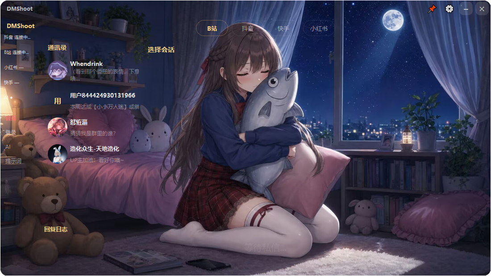
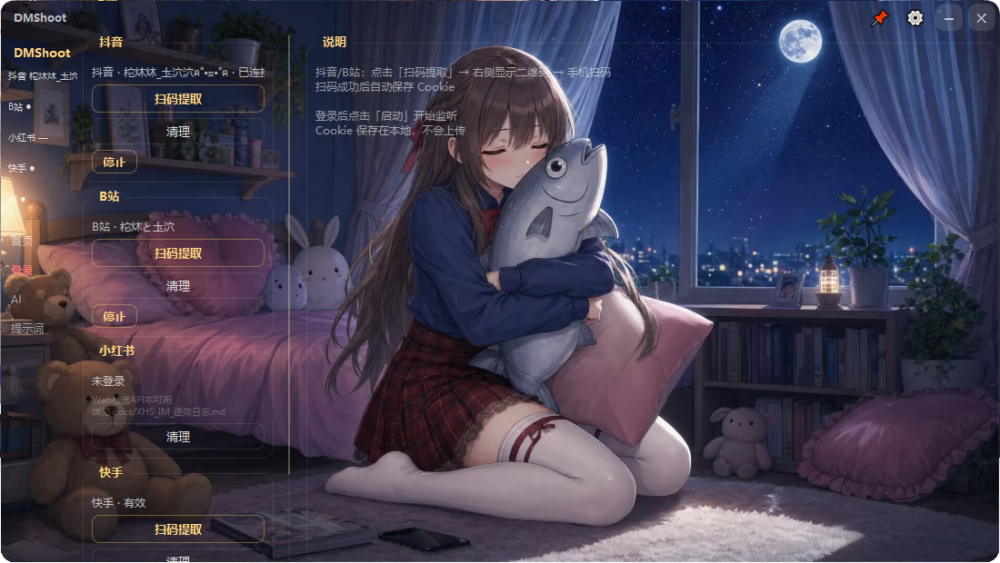
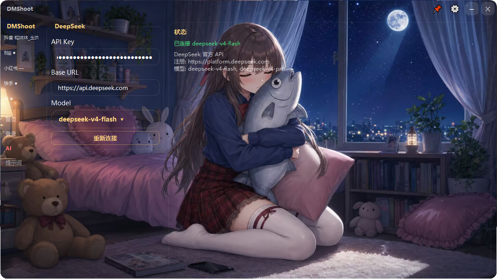
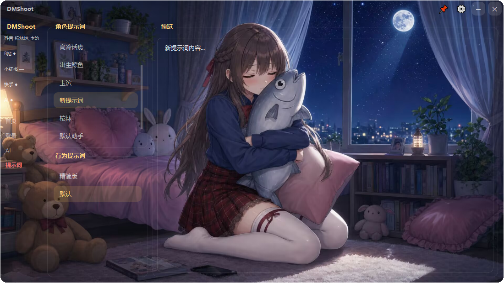
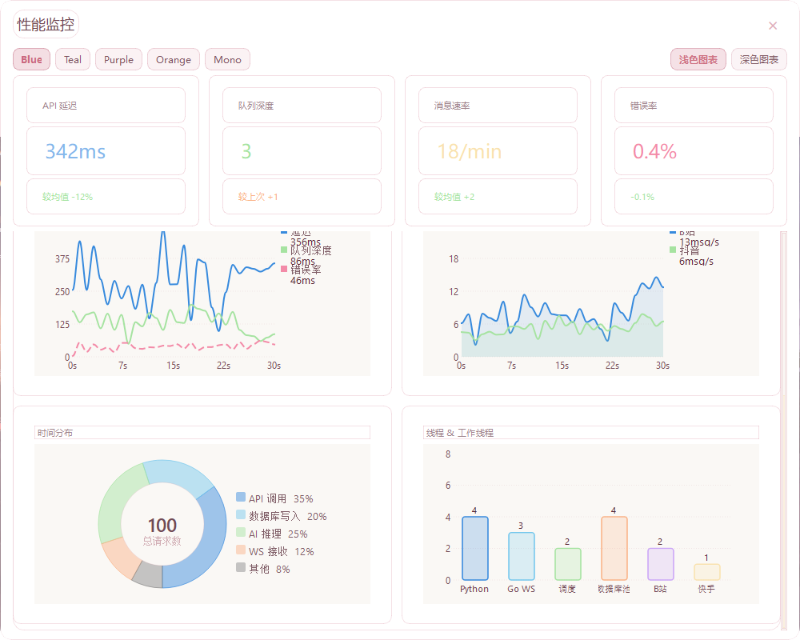
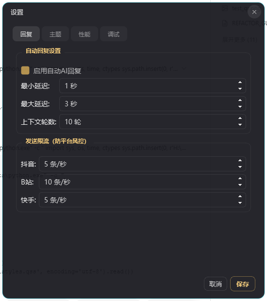

# DMShoot - 多平台私信聚合工具

[](https://www.python.org/)
[](https://pypi.org/project/PySide6/)
[](https://www.sqlite.org/)
[](LICENSE)

一个基于 PySide6 的多平台私信聚合桌面应用，支持抖音、B站等平台的私信接收与 AI 自动回复。



---

## 主要功能

### 多平台私信聚合
- **抖音** & **B站** 私信实时接收与发送
- 统一消息总线架构，插件式平台适配器
- 侧边栏连接状态实时反馈

### 扫码登录
- 基于 **Playwright** 的自动化浏览器扫码
- 支持 Cookie 持久化，一次登录长期有效
- 自动检测登录状态，过期自动重新扫码



### AI 智能回复
- 集成 **DeepSeek API**（兼容 OpenAI 格式）
- 多角色提示词系统：自定义 AI 性格与回复风格
- 支持行为预设 + 角色预设双维度配置
- 可配置回复延迟、上下文轮数、模型参数



### 提示词管理
- 内置热情朋友、专业客服、高冷话痨三组角色
- 可自定义行为预设和角色预设
- 实时预览和编辑



---

## 次要功能

| 功能 | 说明 |
|------|------|
| **深色/浅色主题** | 侧边栏一键切换，自动适配全部界面 |
| **自定义壁纸** | 聊天背景支持自定义图片 |
| **窗口置顶** | 标题栏图钉按钮，始终可见 |
| **性能监控** | CPU/内存/消息吞吐量实时图表 + 弹出窗口 |
| **WAL 五层防御** | 防止 SQLite WAL 模式文件损坏 |


| **消息去重** | 数据库唯一索引 + 内存集合双防线 |
| **断线重连** | 指数退避（1→30s）自动重连 |
| **速率限制** | 8 workers 共享线程池 + 背压控制 |
| **终端日志** | 结构化彩色终端输出，带时间戳和模块标签 |



---

## 技术架构

```
┌─────────────────────────────────────────────────────────────┐
│                      PySide6 GUI                             │
│  ┌──────────┐ ┌──────────┐ ┌──────────┐ ┌────────────────┐  │
│  │  Home    │ │  Login   │ │  AI      │ │  Prompt        │  │
│  │  聊天页  │ │  扫码登录 │ │  DeepSeek│ │  提示词配置    │  │
│  └──────────┘ └──────────┘ └──────────┘ └────────────────┘  │
├─────────────────────────────────────────────────────────────┤
│                MessageBus (单例事件中枢)                      │
│  6个核心 Signal：connected/disconnected/message/               │
│                  platform_status/log/stream_log               │
├─────────────────────────────────────────────────────────────┤
│  PluginManager → Adapters (QThread)                          │
│  ┌──────────────┐  ┌──────────────┐                         │
│  │  Douyin      │  │   Bilibili   │                         │
│  │  Adapter     │  │   Adapter    │                         │
│  │  (asyncio)   │  │   (asyncio)  │                         │
│  └──────────────┘  └──────────────┘                         │
├─────────────────────────────────────────────────────────────┤
│  ConcurrencyManager                                          │
│  ├─ 8 workers 共享线程池                                      │
│  ├─ 100 任务队列背压控制                                      │
│  └─ 任务优先级调度                                            │
├─────────────────────────────────────────────────────────────┤
│  SQLite (WAL)            │  msg-service (Go/WS)             │
│  ├─ WAL 五层防御         │  ├─ HTTP API                     │
│  ├─ 唯一索引去重         │  ├─ WebSocket 广播               │
│  └─ WAL checkpoint       │  └─ 消息批量写入                 │
└─────────────────────────────────────────────────────────────┘
```

### WAL 五层防御机制

SQLite WAL 模式在高并发场景下可能出现损坏。DMShoot 部署五层防御：

| 层级 | 实现 | 说明 |
|------|------|------|
| **L1** | Python `atexit` | 进程正常退出时 checkpoint |
| **L2** | Go 60s 定期 | msg-service 每 60s 被动 checkpoint |
| **L3** | 自动恢复 | 启动时检测 WAL 状态，损坏自动恢复 |
| **L4** | 紧急脚本 | `tools/wal_checkpoint.py` 手动强制 checkpoint |
| **L5** | PRAGMA 调优 | `wal_autocheckpoint=200`, `synchronous=NORMAL` |

```python
# 紧急恢复脚本用法
python tools/wal_checkpoint.py --force    # 强制 checkpoint
python tools/wal_checkpoint.py --watch    # 持续监控
```

### 消息去重机制

**双防线设计：**

1. **数据库防线**：`ChatMessage.msg_hash` + `UNIQUE` 约束
   ```python
   msg_hash = Column(String(32), unique=True, index=True)
   ```

2. **内存防线**：运行期 `set` 快速去重
   ```python
   self._seen_hashes: Set[str] = set()
   ```

### 断线重连机制

**指数退避算法**（1s → 2s → 4s → ... → 30s）：

```python
class ReconnectBackoff:
    def __init__(self):
        self._delay = 1.0
        self._max = 30.0
    
    def next(self) -> float:
        d = self._delay
        self._delay = min(self._delay * 2, self._max)
        return d
    
    def reset(self):
        self._delay = 1.0  # 连接成功后重置
```

### 错误分类体系

```python
class ErrorCategory(Enum):
    NETWORK = "network"      # 网络超时、连接断开
    AUTH = "auth"            # Cookie 过期、权限不足
    PLATFORM = "platform"    # API 限制、频率限制
    INTERNAL = "internal"    # 代码异常、未捕获错误

# 使用
self.on_error(ErrorCategory.AUTH, "Cookie 已过期")
```

---

## 快速开始

### 环境要求
- Python 3.10+
- Node.js 18+（抖音/B站/小红书签名需要）
- Go 1.21+（可选，仅 msg-service 需要）

### 安装

```bash
# 1. 克隆仓库
git clone https://github.com/yourname/DMShoot.git
cd DMShoot

# 2. 运行安装脚本
setup.bat

# 或手动安装：
python -m venv .venv
.venv\Scripts\activate
pip install -r requirements.txt
playwright install chromium
```

### 运行

```bash
# 一键启动
run.bat

# 或手动：
.venv\Scripts\activate
python main.py
```

---

## 配置说明

首次运行后，应用会在 `dmshoot/data/` 目录下自动创建 SQLite 数据库。

### 核心配置项

| 配置项 | 说明 | 默认值 |
|--------|------|--------|
| `api_key` | DeepSeek API 密钥 | 空（需手动填写） |
| `base_url` | API 地址 | `https://api.deepseek.com` |
| `model` | AI 模型 | `deepseek-v4-flash` |
| `auto_reply_enabled` | 启用自动回复 | `true` |
| `reply_delay_min` | 回复最小延迟 | `1.0` 秒 |
| `reply_delay_max` | 回复最大延迟 | `3.0` 秒 |
| `max_context_rounds` | AI 上下文轮数 | `10` |

### 配置存储位置

```
dmshoot/data/
├── dmshoot.db              # SQLite 主数据库
├── dmshoot.db-shm          # WAL 共享内存 (临时)
└── dmshoot.db-wal          # WAL 日志 (临时)
```

---

## 项目结构

```
DMShoot/
├── main.py                     # 入口文件
├── dmshoot/
│   ├── core/                   # 核心模块
│   │   ├── bus.py              # MessageBus 事件总线
│   │   ├── adapter.py          # BaseAdapter 适配器基类
│   │   ├── adapter_manager.py  # 适配器生命周期管理
│   │   ├── msg_service.py      # 消息服务集成
│   │   ├── concurrency.py      # 并发管理
│   │   └── perf_monitor.py     # 性能监控
│   ├── gui/                    # GUI 模块
│   │   ├── main_window.py      # 主窗口
│   │   ├── pages/              # 各页面
│   │   │   ├── home_page.py    # 首页（聊天）
│   │   │   ├── login_page.py   # 登录页
│   │   │   ├── deepseek_page.py # AI 设置
│   │   │   └── prompt_page.py  # 提示词配置
│   │   ├── workers/            # QThread 工作线程
│   │   │   ├── ai_worker.py    # AI 调用线程
│   │   │   └── login_worker.py # 扫码登录线程
│   │   └── settings_dialog.py  # 设置对话框
│   ├── plugins/
│   │   ├── douyin/             # 抖音适配器
│   │   ├── bilibili/           # B站适配器
│   │   └── manager.py          # 插件管理器
│   ├── ai/                     # AI 回复模块
│   ├── storage/                # SQLite 数据层
│   └── utils/                  # 工具函数
├── external/
│   └── DouYin_Spider/          # 抖音 SDK（第三方）
├── dmshoot-go/                 # Go 消息服务
│   ├── main.go
│   └── msg-service.exe
├── prompts/                    # AI 角色提示词
├── resources/                  # 壁纸等资源
└── docs/                       # 技术文档
```

---

## 依赖

| 依赖 | 版本 | 用途 |
|------|------|------|
| PySide6 | >=6.5 | GUI 框架 |
| httpx | >=0.27 | HTTP 客户端 |
| bilibili-api-python | >=17.4 | B站 API |
| playwright | >=1.60 | 浏览器扫码登录 |
| websocket-client | >=1.8 | WebSocket 通信 |
| PyYAML | >=6.0 | YAML 配置解析 |
| DouYin_Spider | git | 抖音 SDK（需 clone 到 external/） |

---

## 技术亮点

### 1. 零单例依赖注入

传统单例模式难以测试。DMShoot 使用构造函数注入：

```python
# 重构前（单例）
self.limiter = RateLimiter()  # 全局单例

# 重构后（注入）
def __init__(self, limiter: RateLimiter = None):
    self.limiter = limiter or RateLimiter()  # 可 mock
```

### 2. 门面模式隔离 SDK

```python
# DouyinClient 门面类 — adapter 零直接 SDK 导入
class DouyinClient:
    def connect(self, cookie: str) -> bool: ...
    def send_message(self, user_id: str, text: str) -> bool: ...
    def fetch_history(self) -> List[Message]: ...
```

### 3. SignalWiring 集中管理

```python
# 所有 Qt 信号连接集中在一处
class SignalWiring:
    @staticmethod
    def connect_all(window, adapter_mgr, auth_ctrl):
        window.bus.connected.connect(window.sidebar.on_connected)
        window.bus.disconnected.connect(window.sidebar.on_disconnected)
        # ... 更多信号
```

### 4. 结构化终端日志

```
========================================
  DMShoot 就绪 — 等待连接
========================================

[16:20:15] [B站] ✓ 已连接
[16:20:18] [抖音] ✓ 已连接
[16:20:22] [AI] 收到私信 → 生成回复（耗时 1.2s）
[16:20:24] [抖音] ← 发送消息
```

---

## License

MIT License - 详见 [LICENSE](LICENSE) 文件

## 免责声明

本工具仅供学习和研究使用。使用本工具产生的任何后果由使用者自行承担。请遵守各平台的用户协议和相关法律法规。

---

## 致谢

- [DouYin_Spider](https://github.com/xxx/DouYin_Spider) - 抖音 SDK
- [bilibili-api-python](https://github.com/Nemo2011/bilibili-api) - B站 API
- [DeepSeek](https://deepseek.com/) - AI 模型
